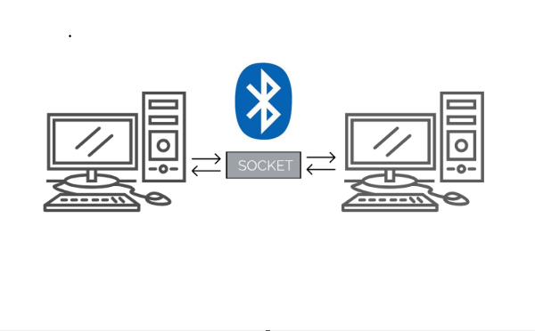
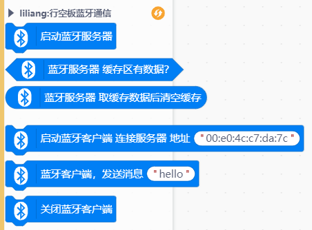
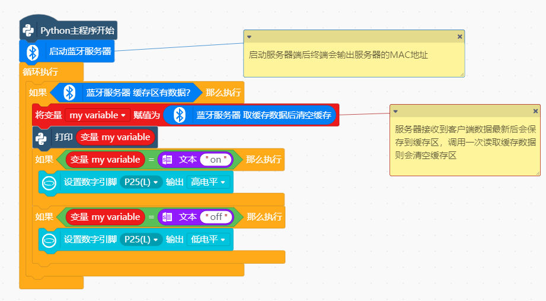
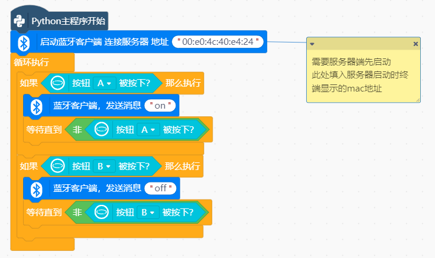
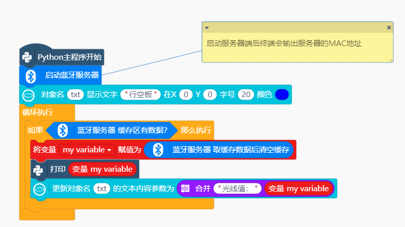
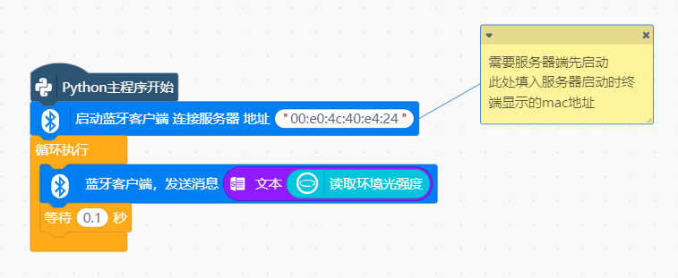
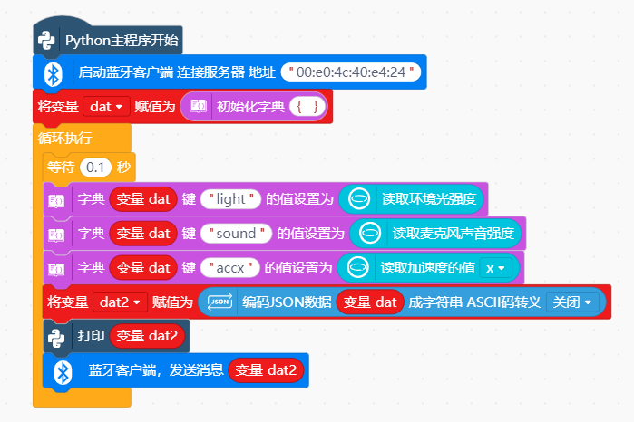
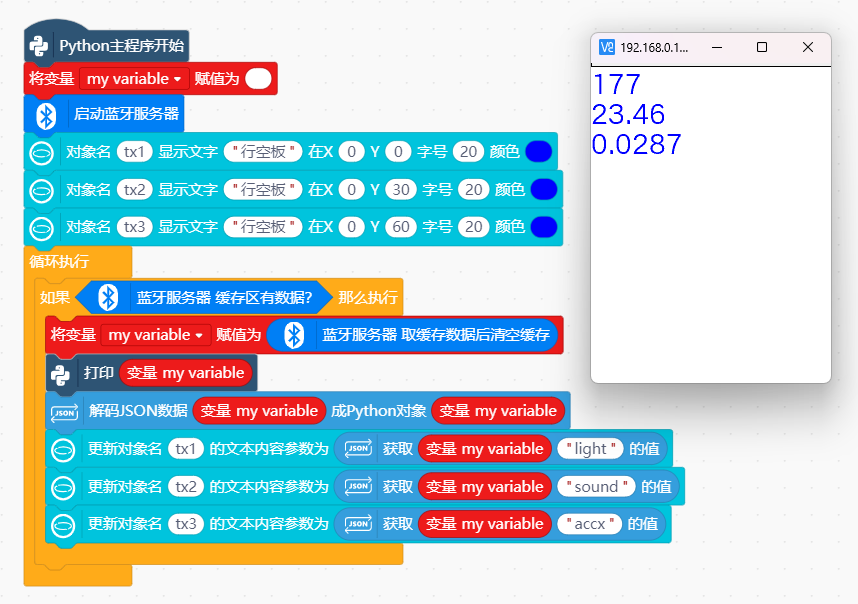

# 行空板蓝牙Socket通信




---------------------------------------------------------

## Table of Contents

* [URL](#url)
* [Summary](#summary)
* [Blocks](#blocks)
* [License](#license)
* [Supported targets](#Supportedtargets)

## URL
* Project URL : ```https://github.com/liliang9693/ext-bluetoothSocket```

* Tutorial URL : ```https://mindplus.dfrobot.com.cn/extensions-user```

    


## Summary
使用Mind+V1.7.2及以上版本，在python模式用户库中加载此扩展，在两块行空板上分别运行服务器端和客户端程序，可实现两块行空板之间通过蓝牙进行Socket通信。

## Blocks




## Examples
- 示例1：行空板1按钮控制行空板2上的L灯
    - 服务器端  
      

    - 客户端  
      

- 示例2：行空板1上的光线数据发送到行空板2屏幕上显示

    - 服务器端  
      

    - 客户端  
      

- 示例3：行空板1上的多个数据发送到行空板2屏幕上显示，使用字典和json

    - 服务器端  
      

    - 客户端  
      


## License

MIT

## Supported targets

MCU                | JavaScript    | Arduino   | MicroPython    | Python 
------------------ | :----------: | :----------: | :---------: | -----
arduino        |             |              |             | 
micro:bit        |             |              |             | 
esp32        |             |              |             | 
unihiker m10       |             |              |             | √

## Release Logs

* V0.0.1  基础功能完成
* V0.0.2  增加英文翻译
